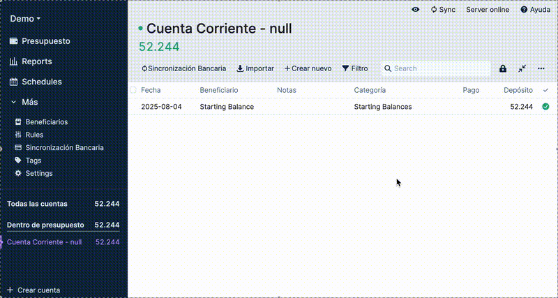
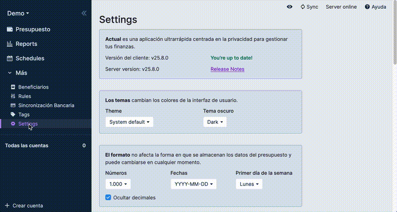

# Ahorratrón


> 🐷💾 El chanchito que sincroniza tus finanzas

**Ahorratrón** es una API compatible con [Pluggy.ai](https://pluggy.ai) que permite sincronizar automáticamente tus cuentas bancarias chilenas con [Actual Budget](https://actualbudget.com/).

Conecta directamente con los sistemas bancarios para obtener cuentas, saldos y transacciones de forma automática y segura, emulando la API de Pluggy.ai para que Actual Budget pueda sincronizar sin modificaciones.

## 🎬 Demo en Acción

La siguiente demo muestra [Actual Budget](https://actualbudget.com/) sincronizando automáticamente las transacciones de una cuenta corriente del Banco de Chile:



> **Nota:** Esta demo utiliza datos en caché para mostrar el proceso de forma rápida. En un entorno real, la sincronización completa toma ~30 segundos (incluye el inicio de sesión bancario y la obtención de transacciones).

---

## 🏦 Bancos e Instituciones Soportadas

| Institución | Cuentas Corrientes | Cuentas Vista | Cuentas de Ahorro | Tarjetas de Crédito Facturados | Tarjetas de Crédito No Facturados | Estado |
|-------------|:------------------:|:-------------:|:-----------------:|:-------------:|:----------------:|:------:|
| **Banco de Chile** | ✅ | ✅ | - | ✅ | ✅ | **Implementado** |
| **Banco Consorcio** | ✅ | X | X | X | X | WIP |
| **Banco Santander** | - | - | - | - | - |  |
| **Banco Estado** | - | - | - | - | - |  |
| **Banco Security** | - | - | - | - | - |  |
| **Banco Falabella** | - | - | - | - | - |  |
| **Scotiabank** | - | - | - | - | - |  |
| **Banco BCI** | - | - | - | - | - |  |
| **Banco Itaú** | - | - | - | - | - |  |
| **Coopeuch** | - | - | - | - | - |  |
| **Fintual** | - | - | - | - | - | Coming soon? |

**Leyenda:**
- ✅ **Implementado**: Funciona completamente
- **-** : Pull requests bienvenidos: ¡Contribuciones de la comunidad son bienvenidas!

---

## 🚀 Inicio Rápido con Docker

La forma más sencilla de usar Ahorratrón es con Docker Compose, que lanza automáticamente:
- Un servidor de Actual Budget
- La API de sincronización bancaria de Ahorratrón
- Un servidor Selenium para la conexión con los bancos

### Configuración

1. **Clona el repositorio:**
   ```bash
   git clone https://github.com/diegocaro/ahorratron.git
   cd ahorratron
   ```

2. **Crea el archivo de configuración:**
   ```bash
   cp .env.example .env
   ```

3. **Configura tus credenciales bancarias** en el archivo `.env`:
   ```bash
   BANK_LOGIN_URL=https://banco.cl/login
   BANK_API_BASE_URL=https://banco.cl/api
   HEADER_REFERER=https://banco.cl/index.html
   HEADER_ORIGIN=https://banco.cl
   JWE_SECRET_KEY="llave_secreta_para_encriptar"
   JWT_SECRET_KEY="llave_secreta_para_firmar"
   ```

4. **Inicia los servicios:**
   ```bash
   docker-compose up
   ```

### Acceso a la Aplicación

Una vez iniciados los servicios, podrás acceder a:

- **Actual Budget**: http://localhost:5006
- **API de Ahorratrón**: https://localhost:8443

### Configuración de Actual Budget



Para conectar tu banco con Actual Budget a través de Ahorratrón:

1. **Crea una cuenta en Actual Budget:**
   - Ve a http://localhost:5006
   - Crea un nuevo presupuesto o selecciona uno existente

2. **Activa la funcionalidad experimental de Pluggy.ai:**
   - En Actual Budget, ve a **Settings** (Configuración)
   - Busca la opción **Experimental Features** (Funcionalidades Experimentales)
   - Activa la opción **Pluggy.ai Integration** (Experimental)

3. **Configura la conexión bancaria:**
   - Ve a la sección de **Accounts** (Cuentas) en Actual Budget
   - Busca la opción **Set up Pluggy.ai for bank sync**
   - Ingresa los siguientes datos:
     - **Client ID**: Tu RUT (ej: 12345678-9)
     - **Client Secret**: Tu clave del banco
     - **Items ID**: `chile`

4. **Vincula tu cuenta bancaria:**
   - Elige las cuentas que deseas sincronizar
   - Confirma la vinculación

Una vez completado, tus transacciones bancarias se sincronizarán automáticamente con tu presupuesto en Actual Budget.

---

## 💻 Desarrollo Local

Requiere Python 3.12 o superior.

```bash
git clone git@github.com:diegocaro/ahorratron.git
cd ahorratron
uv sync
```

```bash
# Ejecutar en modo desarrollo
uv run uvicorn ahorratron.sync_api.main:app --reload --port 8000
```

---

## 🔒 Autenticación y Seguridad

### Flujo de Autenticación

1. **Cliente** envía credenciales bancarias a `/auth`
2. **Sync API** valida credenciales con el banco
3. **Sistema** genera token JWT encriptado con credenciales
4. **Cliente** usa el token para todas las operaciones subsiguientes
5. **Sync API** desencripta token y usa credenciales para consultas bancarias

### Soporte Multi-banco

Las credenciales pueden enviarse en formato simple (un solo banco) o codificadas en base64 (múltiples bancos). Ver la [documentación de la API](ahorratron/sync_api/README.md) para más detalles.

---

## Contribuciones

¡Las contribuciones son bienvenidas! Si tienes ideas para mejorar Ahorratrón o quieres agregar soporte para otros bancos, no dudes en crear un issue o enviar un pull request.

## 📝 Licencia

Licencia MIT.

> *Hecho con cariño, Python y ganas de ahorrar 🇨🇱*

